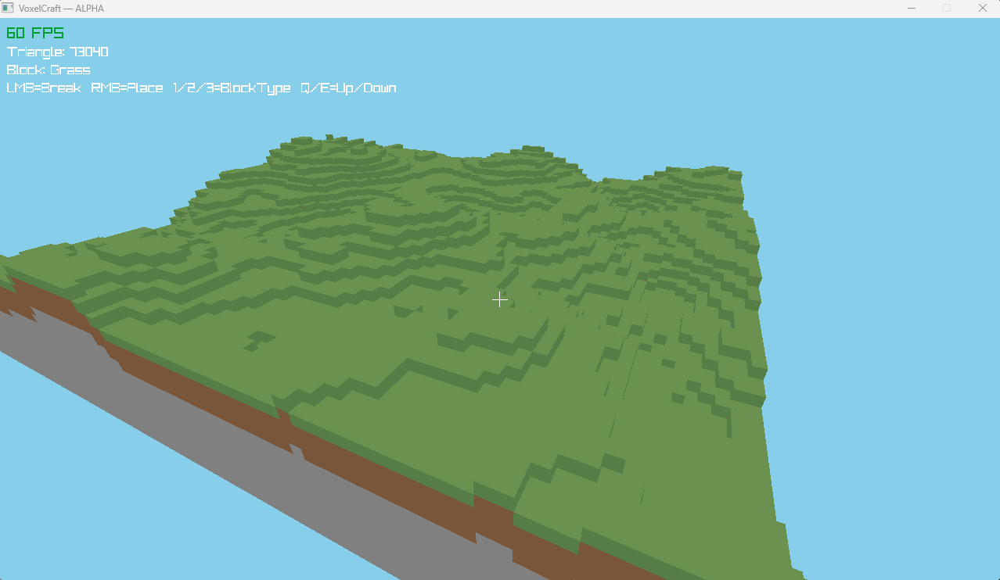

# Voxelcraft

----

This is my First Minecraft Clone in C and RayLib.

---

## Preview

---

## Features

- Chunk Generation (in this version are 5 by 5 chunks)
- Simple Perlin Noise
- Simple Texturing with Colors
- Face Culling to reduce the rendered Faces
- Free Camera to Look Around
- Ray cast to break and set blocks
- Basic Crosshair

---

## Contribution 

### If you have any ideas or cool features, feel free to clone the project or let me know, and I'm sure we can make it happen together.

[Discord](https://discord.gg/Tp2g6eAmjS)
